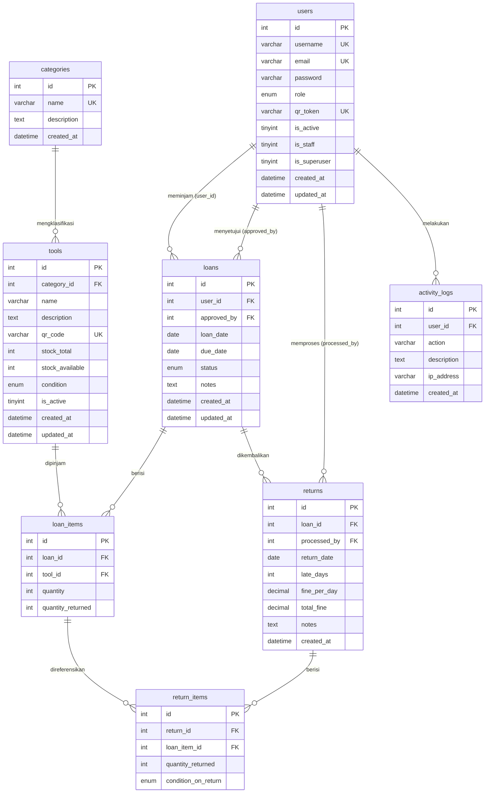

# Database Structure & ERD Explanation
**Project:** School Equipment Loan Management System  
**Version:** v1.2.3  
**Status:** Technical Document (Developer Reference)

---

## 1. Entity Relationship Diagram



### Relation Summary

| Relation | Type | Description |
|----------|------|-------------|
| `users` → `loans` (user_id) | One to Many | One user can have many loans |
| `users` → `loans` (approved_by) | One to Many | One staff can approve many loans |
| `users` → `returns` | One to Many | One staff can process many return sessions |
| `categories` → `tools` | One to Many | One category can have many tools |
| `loans` → `loan_items` | One to Many | One loan can contain many tools |
| `loans` → `returns` | One to Many | One loan can have many return sessions |
| `returns` → `return_items` | One to Many | One return session can contain many tools |
| `loan_items` → `return_items` | One to Many | One loan item can be returned gradually |

---

## 2. Table Details & Columns

### 2.1 Table `users`
Stores the identity of all system users.

| Column | Type | Description |
|--------|------|-------------|
| `id` | INT | Primary Key (Auto Increment) |
| `username` | VARCHAR(50) | Unique, used for login |
| `email` | VARCHAR(100) | Unique, must use school domain (`@smk-2sbg.sch.id`) |
| `password` | VARCHAR(255) | Hashed using **Argon2** (Password Hashing Competition winner) |
| `role` | ENUM | One of: `admin`, `petugas`, `peminjam` |
| `qr_token` | VARCHAR(64) | Unique UUID4 token encoded into a physical QR Card |
| `is_active` | TINYINT | Soft-delete flag — inactive users cannot login |
| `is_staff` | TINYINT | Django Admin access flag |

> **Note:** Passwords are never stored in plain text. Argon2 hashing is handled automatically by Django's `set_password()` method.

---

### 2.2 Table `categories`
Classification of equipment.

| Column | Type | Description |
|--------|------|-------------|
| `id` | INT | Primary Key |
| `name` | VARCHAR(100) | Category name (Unique) |
| `description` | TEXT | Short description |

---

### 2.3 Table `tools`
Physical equipment catalog with stock and condition tracking.

| Column | Type | Description |
|--------|------|-------------|
| `id` | INT | Primary Key |
| `category_id` | INT | Foreign Key to `categories` |
| `name` | VARCHAR(150) | Equipment name |
| `stock_total` | INT | Total stock from procurement |
| `stock_available` | INT | Current borrowable stock (always <= stock_total) |
| `condition` | ENUM | One of: `baik`, `rusak_ringan`, `rusak_berat` |
| `qr_code` | VARCHAR(64) | Unique UUID4 token printed as a physical QR label on the equipment |
| `is_active` | TINYINT | Inactive tools cannot be borrowed (auto-set when condition = `rusak_berat`) |

> **Note:** `stock_available` is protected by a CHECK constraint — it can never exceed `stock_total` at the database level.

---

### 2.4 Table `loans` (Loan Header)
Records who borrowed what and when.

| Column | Type | Description |
|--------|------|-------------|
| `id` | INT | Primary Key |
| `user_id` | INT | Foreign Key to `users` (the borrower) — NOT NULL |
| `approved_by` | INT | Foreign Key to `users` (the approving staff) — nullable until approved |
| `loan_date` | DATE | Date the loan was created |
| `due_date` | DATE | Expected return date |
| `status` | ENUM | One of: `pending`, `approved`, `rejected`, `partial_returned`, `returned` |
| `notes` | TEXT | Optional notes from the borrower |

> **Note:** `approved_by` is nullable because when a loan is first created, no one has approved it yet. It is filled in when a Petugas or Admin approves the request.

**Status Lifecycle:**
```
pending → approved → partial_returned → returned
        ↘ rejected
```

---

### 2.5 Table `loan_items` (Loan Detail)
Line items for each loan — one row per equipment type per loan.

| Column | Type | Description |
|--------|------|-------------|
| `id` | INT | Primary Key |
| `loan_id` | INT | Foreign Key to `loans` |
| `tool_id` | INT | Foreign Key to `tools` |
| `quantity` | INT | Number of units borrowed |
| `quantity_returned` | INT | Number of units returned so far (auto-updated by trigger) |

> **Note:** `quantity_returned` is never updated directly by application code. It is maintained automatically by the `trg_process_return_item` trigger on every insert into `return_items`.

---

### 2.6 Table `returns` (Return Session)
Each time a student brings back equipment, one session record is created here.

| Column | Type | Description |
|--------|------|-------------|
| `id` | INT | Primary Key |
| `loan_id` | INT | Foreign Key to `loans` (no UNIQUE constraint — one loan can have multiple return sessions) |
| `processed_by` | INT | Foreign Key to `users` (the staff who processed the return) |
| `return_date` | DATE | Actual return date |
| `late_days` | INT | Number of late days (auto-calculated by SP) |
| `fine_per_day` | DECIMAL | Fine rate used for this session |
| `total_fine` | DECIMAL | Total fine for this session (auto-calculated by SP) |
| `notes` | TEXT | Optional notes from the staff |

> **Note:** `loan_id` intentionally has no UNIQUE constraint to support partial returns. A single loan can have multiple return sessions across different dates.

---

### 2.7 Table `return_items` (Return Detail)
Per-equipment detail within a single return session.

| Column | Type | Description |
|--------|------|-------------|
| `id` | INT | Primary Key |
| `return_id` | INT | Foreign Key to `returns` |
| `loan_item_id` | INT | Foreign Key to `loan_items` |
| `quantity_returned` | INT | Number of units returned in this session |
| `condition_on_return` | ENUM | Condition when received: `baik`, `rusak_ringan`, `rusak_berat` |

> **Note:** Condition is recorded per-equipment, not per-session. The trigger reads this value and applies a downgrade-only rule to update `tools.condition`.

---

### 2.8 Table `activity_logs` (Audit Trail)
Automatic activity log for every critical system action.

| Column | Type | Description |
|--------|------|-------------|
| `id` | INT | Primary Key |
| `user_id` | INT | Foreign Key to `users` — SET NULL if user is deleted |
| `action` | VARCHAR(100) | Action name (e.g., `APPROVE_LOAN`, `USER_CREATED`) |
| `description` | TEXT | Narrative description of the action |
| `ip_address` | VARCHAR(45) | IPv4 or IPv6 address of the requester |
| `created_at` | DATETIME | Timestamp of the action |

> **Note:** `user_id` uses `ON DELETE SET NULL`. If a user is deleted, their activity history is preserved with `user_id = NULL`. Audit trails must never be destroyed.

---

## 3. Key Relationship Logic

**Partial Return Support**  
One `Loan` can have many `Returns` (return sessions). For example: borrow 10 chairs, return 5 today (Return #1), return the remaining 5 next week (Return #2). The `return_items` table links each returned unit back to its original `loan_items` record, enabling precise tracking of what has and hasn't been returned.

**Double FK to Users**  
The `loans` table has two Foreign Keys pointing to the same `users` table — one as the subject (borrower) and one as the authority (approver). This design allows the system to track both who made the request and who authorized it, while enforcing that they cannot be the same person.

**Audit Trail Preservation**  
`activity_logs` is designed with `ON DELETE SET NULL` on `user_id`. This ensures that even if a user account is deleted, their historical activity records remain intact in the system for accountability purposes.

---

## 4. Database-Level Security

**Trigger `trg_validate_loan_approver`**  
Prevents fraud at the database level. A borrower cannot approve their own loan request, even if they have direct database access or bypass the API layer.

**Trigger `trg_decrease_stock_on_approve`**  
Uses `SELECT FOR UPDATE` (row-level locking) to prevent race conditions. If two staff members attempt to approve different loans for the same equipment simultaneously, the second approval must wait for the first to complete — preventing stock from going negative.

**Trigger `trg_process_return_item`**  
Enforces a downgrade-only rule on equipment condition. A returned tool can only move to a worse condition (`baik` → `rusak_ringan` → `rusak_berat`), never automatically back to a better one. If a tool is returned as `rusak_berat`, it is automatically deactivated pending Admin review.

**CHECK Constraint on Stock**  
`stock_available <= stock_total` is enforced at the database level. No application bug can cause available stock to exceed total stock.

**SP Transaction Atomicity**  
The entire loan creation process runs inside a single database transaction via `sp_create_loan`. If any item fails its stock lock, the entire loan is rolled back — no partial or dangling data is ever left in the database.