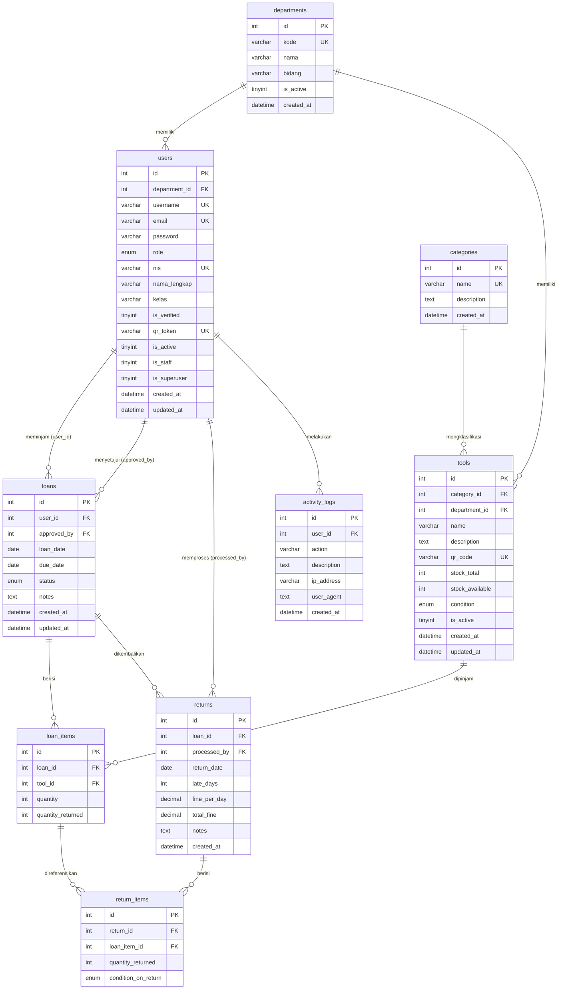

# Database Structure & ERD Explanation
**Project:** School Equipment Loan Management System  
**Version:** v2.0.0 (Departmental Release)
**Status:** Technical Document (Developer Reference)

---

## 1. Entity Relationship Diagram

### Relation Summary (v2.0.0 Updates)

| Relation | Type | Description |
|----------|------|-------------|
| `departments` → `users` | One to Many | One department has many students/staff |
| `departments` → `tools` | One to Many | One department owns many tools |
| `users` → `loans` (user_id) | One to Many | One student can have many loans |
| `users` → `loans` (approved_by) | One to Many | One staff can approve many loans |
| `categories` → `tools` | One to Many | One category can have many tools |

---

## 2. Table Details (v2.0.0 Updates)

### 2.1 Table `departments` [NEW v2.0.0]
Stores information about school departments (e.g., RPL, TPM, TSM).

| Column | Type | Description |
|--------|------|-------------|
| `id` | INT | Primary Key |
| `kode` | VARCHAR(10) | Unique code (e.g., 'RPL') |
| `nama` | VARCHAR(100) | Full name of the department |
| `bidang` | VARCHAR(100) | Industry field (e.g., 'Agribisnis') |

---

### 2.2 Table `users` [UPDATED v2.0.0]
Added departmental and academic identity fields.

| Column | Type | Description |
|--------|------|-------------|
| `department_id` | INT | Foreign Key to `departments` (nullable for generic admin) |
| `nis` | VARCHAR(20) | Unique Student Identification Number |
| `nama_lengkap` | VARCHAR(100) | Student's full name |
| `kelas` | VARCHAR(20) | Student's class (e.g., 'X RPL A') |
| `is_verified` | TINYINT | Verification flag for student identity |

---

### 2.3 Table `tools` [UPDATED v2.0.0]
Added departmental ownership.

| Column | Type | Description |
|--------|------|-------------|
| `department_id` | INT | Foreign Key to `departments` (nullable for general equipment) |

---

### 2.4 Table `activity_logs` [UPDATED v2.0.0]
Added user agent tracking for better audit trails.

| Column | Type | Description |
|--------|------|-------------|
| `user_agent` | TEXT | Captured browser/client signature |

---

## 3. SQL Logic Integration

The v2.0.0 system continues to use **Stored Procedures** and **Triggers** for core logic (fines, stock, audit logs) while adding departmental context for access control. Database triggers ensure that even if the API is bypassed, data integrity across departments is maintained.
