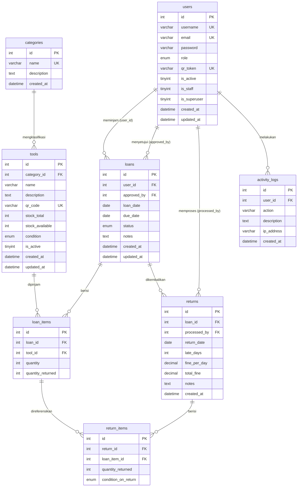

# Database ERD — Equipment Loan System
**Version:** v1.2.3

---

## Keterangan Relasi

| Relasi | Tipe | Keterangan |
|--------|------|------------|
| `users` → `loans` (user_id) | One to Many | Satu user bisa punya banyak pinjaman |
| `users` → `loans` (approved_by) | One to Many | Satu petugas bisa approve banyak pinjaman |
| `users` → `returns` | One to Many | Satu petugas bisa proses banyak pengembalian |
| `categories` → `tools` | One to Many | Satu kategori bisa punya banyak alat |
| `loans` → `loan_items` | One to Many | Satu pinjaman bisa punya banyak alat |
| `loans` → `returns` | One to Many | Satu pinjaman bisa punya banyak sesi pengembalian |
| `returns` → `return_items` | One to Many | Satu sesi pengembalian bisa punya banyak alat |
| `loan_items` → `return_items` | One to Many | Satu loan item bisa dikembalikan bertahap |

---

## Catatan Penting

- `loans.approved_by` **nullable** — kosong saat pertama dibuat, diisi saat disetujui
- `returns.loan_id` **tidak UNIQUE** — satu loan bisa punya banyak sesi pengembalian (partial return)
- `loan_items.quantity_returned` — diupdate otomatis oleh trigger `trg_process_return_item`
- `tools.condition` — hanya bisa turun (downgrade-only), tidak pernah naik otomatis
